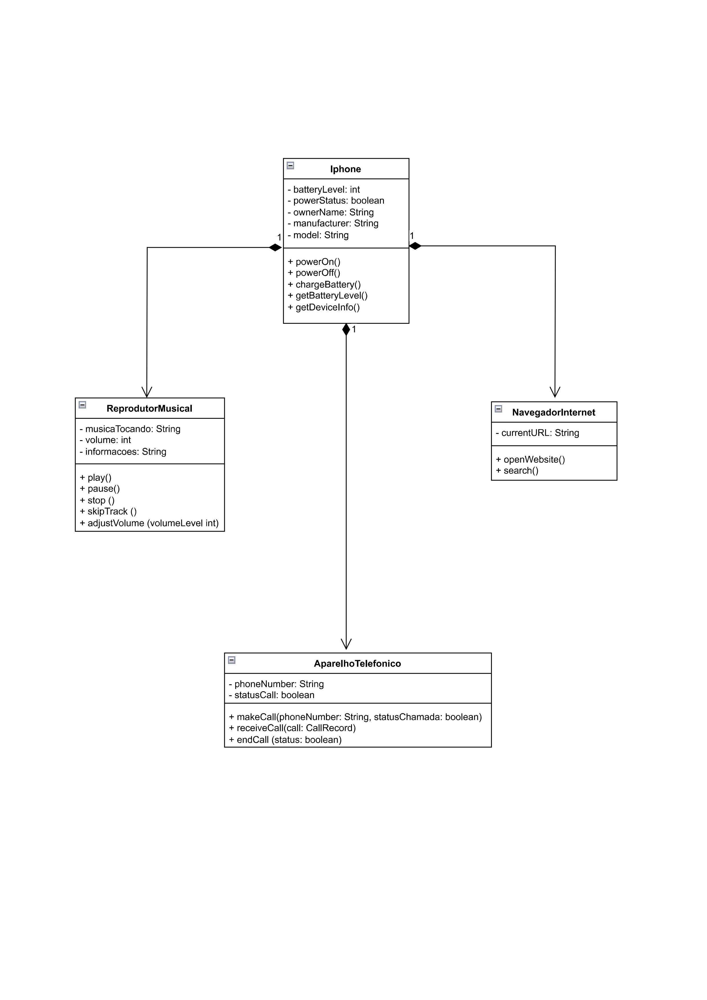

# Protótipo de Aplicativo de Smartphone

Este projeto foi desenvolvido como parte do Bootcamp da Digital Innovation One (DIO) para demonstrar a criação de um aplicativo de smartphone fictício em Java. O objetivo deste projeto é fornecer um exemplo didático de como criar um aplicativo simples que simula as funcionalidades de um Iphone.

## Funcionalidades

O aplicativo de Iphone inclui as seguintes funcionalidades:

- Controle de Bateria
- Reprodução de Música
- Navegação na Internet
- Chamadas Telefônicas

## Diagrama de Classes

O projeto inclui um diagrama UML que representa a estrutura das classes utilizadas no aplicativo.

